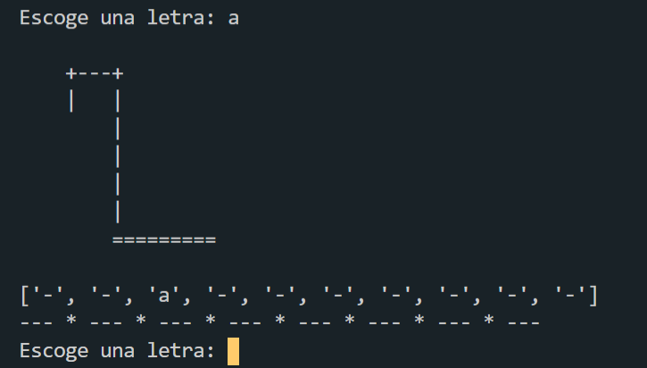

# Juego del ahorcado <!-- omit in toc -->

Juego del ahorcado en Python

## Tabla de Contenido<!-- omit in toc -->
- [Indicaciones](#indicaciones)
- [Características](#caracter%c3%adsticas)
- [Vista previa](#vista-previa)

# Indicaciones
Adivina la palabra oculta antes de que te quedes sin oportunidades

# Características
* Aplicación de consola
* ASCII ART
* Interfaz interactiva
* Python

# Vista previa

  
  <small>
Juego del ahorcado
</small>

